# SecureAWS MySQL: Enterprise-Grade RDS Hardening Framework

This project demonstrates the end-to-end implementation of an enterprise-grade database security framework on Amazon RDS (MySQL).  
It converts a default cloud-provisioned database into a production-ready, multi-layer-secured environment following AWS best practices and the **Defense in Depth** model.

---

## Project Overview

| Item | Description |
|------|--------------|
| **AWS Region** | me-central-1 |
| **Database Engine** | MySQL 8.4 |
| **Architecture Type** | 3-Tier Secure Network |
| **Authentication** | IAM Database Authentication |
| **Encryption** | AWS KMS (At Rest), TLS (In Transit) |
| **Monitoring** | CloudWatch Logs + Enhanced Monitoring |
| **Access Control** | Security Groups with Least Privilege |
| **Availability** | Multi-AZ Deployment |
| **Backup Policy** | Automated Backups + Point-in-Time Recovery |

---

## Architecture Overview

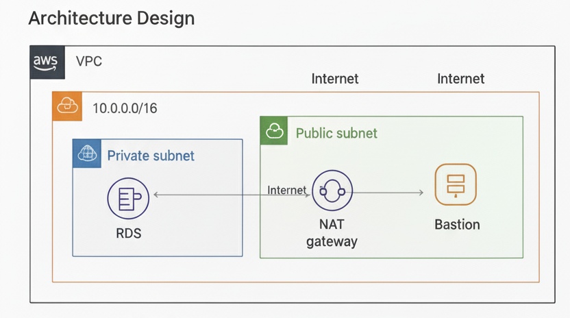 

*This AWS VPC features a Private Subnet housing the isolated RDS database for enhanced security. A Public Subnet contains a NAT Gateway for outbound internet access from private resources, and a Bastion Host for secure administrative entry into the private network. Both subnets are connected to the Internet, with the NAT Gateway facilitating outbound-only connections for private resources, and the Bastion Host allowing controlled inbound access.*

*Secure multi-tier AWS architecture isolating the RDS MySQL database inside private subnets.*

### Key Components
- **VPC (10.0.0.0/16):** logical isolation boundary for all resources  
- **Public Subnets:** host Bastion Host and NAT Gateway  
- **Private Application Subnets:** host application instances  
- **Private Database Subnets:** contain RDS MySQL instance only  
- **Security Groups:** enforce stateful least-privilege firewall rules  
- **CloudWatch:** centralized logging and enhanced monitoring  

---

## Phase 1 — Network Foundation (VPC and Subnets)

### Objective
Create a dedicated and segmented network for database isolation.

### Steps
1. **Create VPC**
   - Console → *VPC > Create VPC*  
     - Name Tag: `secure-db-vpc`  
     - IPv4 CIDR: `10.0.0.0/16`

   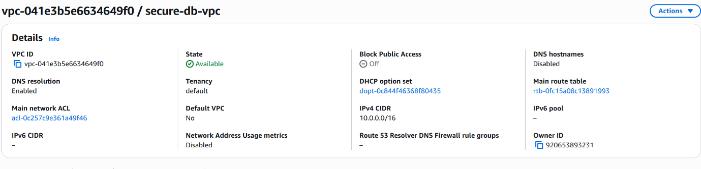

   *Creating the base VPC to isolate cloud resources.*

2. **Create Subnets**
   | Type | Name | CIDR | Purpose |
   |------|------|------|----------|
   | Public | public-1a / public-1b | 10.0.1.0/24 / 10.0.2.0/24 | Bastion & NAT Gateway |
   | Private App | private-app-1a / 1b | 10.0.10.0/24 / 10.0.20.0/24 | Application Layer |
   | Private DB | private-db-1a / 1b | 10.0.100.0/24 / 10.0.200.0/24 | Database Layer |

   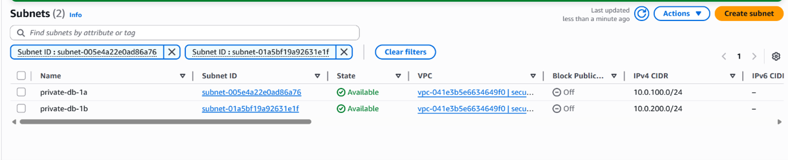

   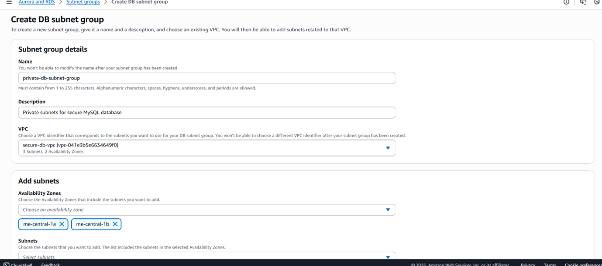

   *Creating public and private subnets across two Availability Zones.*

3. **Create and Attach Internet Gateway**
   - Name: `secure-igw` → Attach to `secure-db-vpc`

4. **Create Route Tables and Routes**
   - *Public RT:* 0.0.0.0/0 → Internet Gateway  
   - *Private App RT:* 0.0.0.0/0 → NAT Gateway  
   - *DB RT:* No direct internet route  

5. **Create NAT Gateway**
   - Public Subnet (public-1a), allocate Elastic IP.

### Rationale
- Keeps database traffic private and unreachable from the internet.  
- Enables app servers to reach AWS services via NAT without inbound exposure.  
- Provides clear network segmentation for compliance and auditing.

---

## Phase 2 — Security Groups and Network Access Control

### Objective
Enforce least-privilege access between tiers using stateful firewall rules.

### Steps
1. **Bastion SG (`bastion-sg`)**
   - Inbound: SSH (22) from trusted IP only (e.g., 203.0.113.5/32)
   - Outbound: All traffic (used for administrative access)

   
2. **Application SG (`app-sg`)**
   - Inbound: HTTP (80) from ALB or public internet  
   - Inbound: SSH (22) from `bastion-sg` for maintenance  
   - Outbound: MySQL (3306) to `db-sg`


3. **Database SG (`db-sg`)**
   - Inbound: MySQL (3306) only from `app-sg` and `bastion-sg`  
   - Outbound: Restricted to internal services or monitoring endpoints

   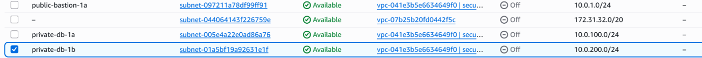

   *Security groups.*

### Rationale
- Explicitly defines traffic flow per tier → prevents lateral movement.  
- Using Security Group referencing ensures tight coupling without hard-coded IPs.  
- Follows **least privilege principle** at network level.

---

## Phase 3 — Bastion Host Deployment

### Objective
Provide a controlled entry point to access private resources.

### Steps
1. EC2 Console → *Launch Instance*
   - Name: `ubuntu-bastion`
   - AMI: Ubuntu Server 22.04 LTS
   - Type: `t2.micro`
   - Key Pair: `ubuntu-bastion-key`
   - Network: `secure-db-vpc`
   - Subnet: `public-1a`
   - Auto-assign Public IP: Enable
   - Security Group: `bastion-sg`

   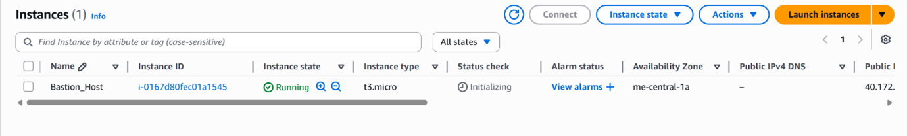

   *Deploying Ubuntu bastion instance in public subnet.*

2. **Connect via SSH**
  
  ```ssh -i ubuntu-bastion-key.pem ubuntu@<BastionPublicIP>```

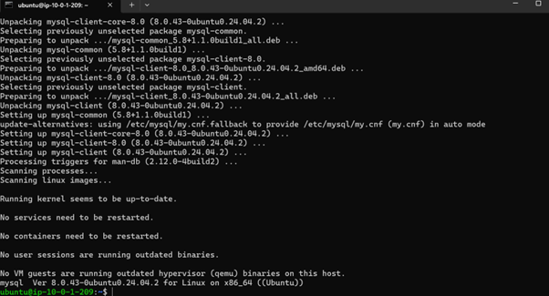

   *SSH to the basion host.*

```bash
  sudo apt update
  sudo apt install mysql-client -y
  mysql --version 
```

---

## Phase 4 — Deploy the RDS MySQL Instance

### Objective
Provision a private, encrypted MySQL database with strong security controls.

### Steps
1. Navigate to **RDS Console → Databases → Create Database**  
   - Engine: MySQL 8.4  
   - Template: Production  
   - DB Identifier: `secure-mysql-db`  
   - Multi-AZ Deployment: Enable  
   - Instance Class: `db.t3.micro`  
   - Storage: 20 GB GP3  
   - Encryption: Enable (AWS KMS default key or custom CMK)  
   - Public Access: **No**  
   - VPC: `secure-db-vpc`  
   - Subnet Group: private-db-1a & private-db-1b  
   - Security Group: `db-sg`  
   - Backup Retention: 1 day (minimum, increase for prod)  
   - Deletion Protection: Enable  

   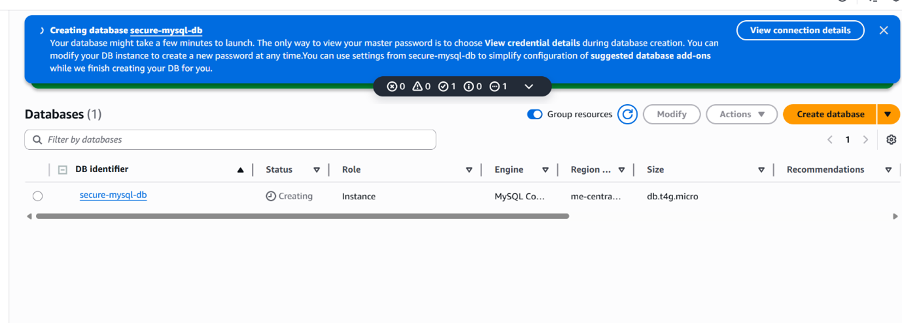  

   * RDS MySQL instance configured for private subnets and KMS encryption.*

2. Wait for the instance status to be **Available**.
3. Connecting to the RDS as Admin
```bash
  mysql -h YOUR_RDS_ENDPOINT -u admin -p
```

   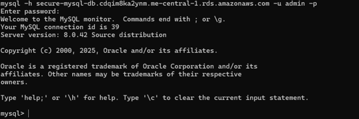
  
   *Connecting to the RDS as Admin .*
4. After connecting to the RDS create IAM_app_user
Create IAM User:
```bash
CREATE USER 'iam_app_user' IDENTIFIED WITH AWSAuthenticationPlugin AS 'RDS';
```
5. Grant Permissions:
```bash
GRANT SELECT, INSERT, UPDATE, DELETE ON secureapp.* TO 'iam_app_user';
```
6.Force SSL:
```bash
ALTER USER 'iam_app_user' REQUIRE SSL;
```

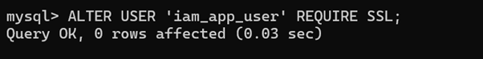 
 
   * forcing ssl connection.*
7.Verify user:
```bash
ALTER USER 'iam_app_user' REQUIRE SSL;
```

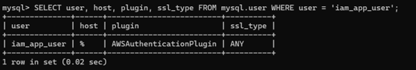 
 
   *Verify user creation.*
8.Install AWS CLI:
```bash
sudo snap install aws-cli –classic
```

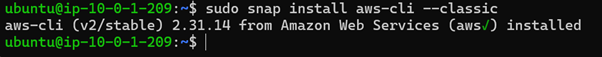 
 
   *Downloading aws cli on basion.*
9.aws configure set output json
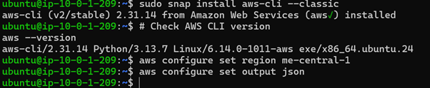  

   *Sets the AWS region to match your RDS instance and Configures output format for easier parsing.*

### Rationale
- Deploying RDS inside private subnets removes direct internet exposure.  
- KMS encryption ensures data-at-rest protection for storage and backups.  
- Multi-AZ enhances availability and disaster recovery.

---

## Phase 5 — Enable IAM Database Authentication

### Objective
Implement token-based, password-less authentication tied to AWS IAM identities.

### Steps
1. Open RDS Console → Databases → select `secure-mysql-db` → **Modify**.  
2. Under **Database Authentication**, choose  
   **“Password and IAM database authentication”**.  
3. Scroll down → check **Apply immediately** → Modify DB instance.  
4. Wait until status returns to *Available*.
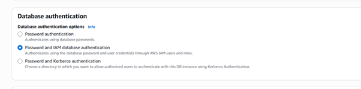  
   *IAM authentication enabled on the RDS MySQL instance..*
5. From bastion host, generate a temporary auth token:
```bash
   TOKEN=$(aws rds generate-db-auth-token \
       --hostname <RDS-ENDPOINT> \
       --port 3306 \
       --username iam_app_user)
```

 
 
   *IAM authentication enabled on the RDS MySQL instance..*
6. Connect using the token:

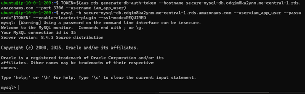  
   *Generate IAM Auth Token and Connect Using IAM Token*

Rationale

Eliminates permanent database passwords.

Tokens expire after 15 minutes, minimizing credential leak risk.

IAM policies centrally control who can authenticate to the database.

## Phase 6 — Database Hardening with Parameter Groups
## Objective

Apply secure MySQL engine parameters to enforce TLS and restrict unsafe operations.

## Steps

RDS Console → Parameter Groups → Create Parameter Group

Family: mysql8.4

Type: DB Parameter Group

Name: mysql-84-secure-pg

Description: Secured MySQL 8.4 parameters with TLS enforcement

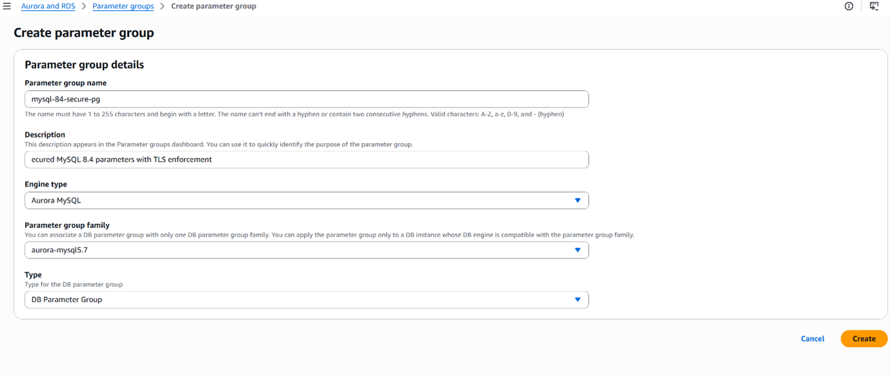  
   *creating a parameter group*


Figure: Custom MySQL parameter group for engine hardening.

Edit the following parameters:

Parameter	           Value	                Purpose
require_secure_transport   1	             Force TLS connections
local_infile 0		   Disable           local file imports
skip_name_resolve	   1	             Prevent DNS spoofing / speed lookups
secure_file_priv	   NULL	             Block filesystem I/O
slow_query_log         	   1                 Enable performance monitoring
long_query_time		   2                  Log queries > 2 s
validate_password.polic    MEDIUM            Enforce strong passwords

Save changes, then apply the group to the DB instance:

RDS → Databases → secure-mysql-db → Modify → DB parameter group: mysql-84-secure-pg → Apply immediately.

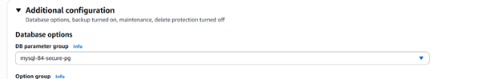 
 
   *Applying the parameter group*

Figure : Applying custom secure parameter group to RDS.

Rationale

Forces encrypted connections (TLS 1.2/1.3) for all clients.

Disables features commonly abused by attackers (local_infile, secure_file_priv).

Enables auditing of slow or abnormal queries for performance visibility.

## Phase 7 — Monitoring and Logging Configuration
## Objective

Establish visibility into database operations and system health.

## Steps

Enable CloudWatch Log Exports

RDS Console → Databases → secure-mysql-db → Modify.

Under Log exports, enable error and slowquery.

Apply changes immediately.

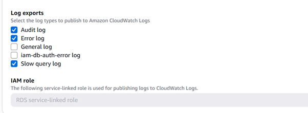  

   *Log export*


Exporting RDS logs to CloudWatch for centralized monitoring.

Enable Enhanced Monitoring

Scroll to Monitoring section → Enable Enhanced Monitoring.

Granularity: 60 seconds.

Monitoring Role: rds-monitoring-role.

Apply changes.
  
   *Enable Enhanced Monitoring*


OS-level metrics via Enhanced Monitoring.

Rationale

Centralized logs simplify auditing and incident response.

Enhanced Monitoring provides real-time CPU, memory, and I/O insights.

Enables alert setup through CloudWatch alarms for critical thresholds.


Validation and Testing
1. Verify IAM Authentication and TLS Enforcement

From bastion host: 

```bash
TOKEN=$(aws rds generate-db-auth-token --hostname <RDS-ENDPOINT> --port 3306 --username iam_app_user)
mysql -h <RDS-ENDPOINT> --user=iam_app_user --password="$TOKEN" --enable-cleartext-plugin --ssl-mode=REQUIRED
```

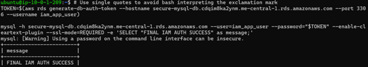  

*Verify IAM Authentication and TLS Enforcement.*

2. Validate Password Policy

```bash
CREATE USER 'weak_user'@'%' IDENTIFIED BY 'weak';
```
-- Fails: does not meet MEDIUM policy
```bash
CREATE USER 'strong_user'@'%' IDENTIFIED BY 'StrongPass123!';
```
-- Succeeds
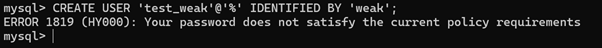  

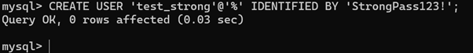

*Validate Password Policy.*

4. Confirm Logging and Monitoring

CloudWatch → Log Groups → /aws/rds/instance/secure-mysql-db/error

CloudWatch → Log Groups → /aws/rds/instance/secure-mysql-db/slowquery

Confirm Enhanced Monitoring metrics appear in RDS console.

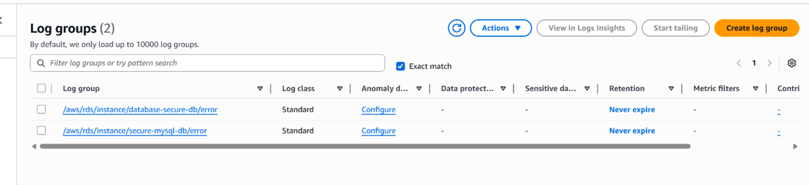

*Confirm Enhanced Monitoring.*


Results and Observations
Control Area	        Verification	                         Outcome
Network Isolation	RDS in private subnets, no public IP	TRUE
IAM Auth	        Token-based connection tested	        TRUE
TLS Enforcement	        Non-SSL connection blocked	        TRUE
Password Policy   	Weak password rejected	                TRUE
CloudWatch Logs	        Error and slowquery streaming verified	TRUE
Enhanced Monitoring	OS-level metrics available	        TRUE

The deployment achieved full compliance with AWS database security best practices:

Defense-in-Depth architecture

Complete encryption coverage

Strong authentication and authorization

Comprehensive auditing and monitoring

## Conclusion

This project demonstrates the deployment of a hardened MySQL RDS instance that adheres to AWS enterprise security and compliance standards through layered controls across network, IAM, database configuration, and monitoring levels.
