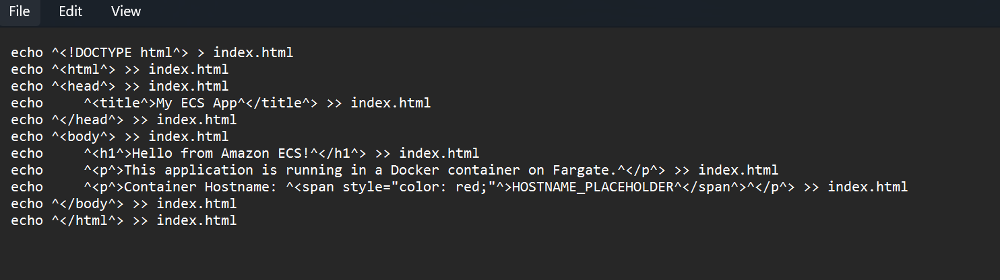
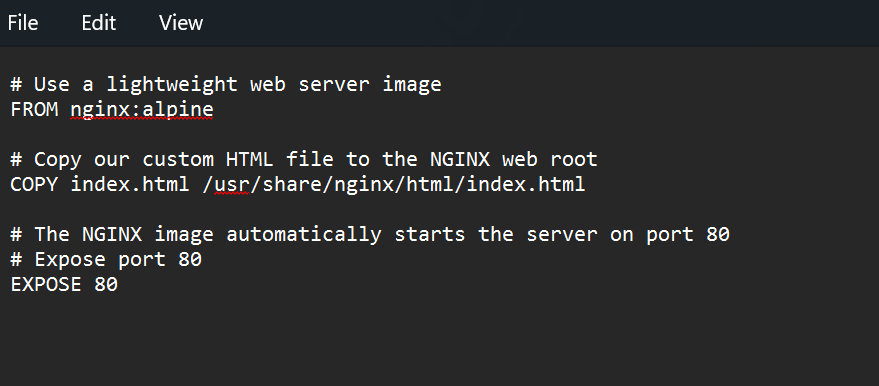
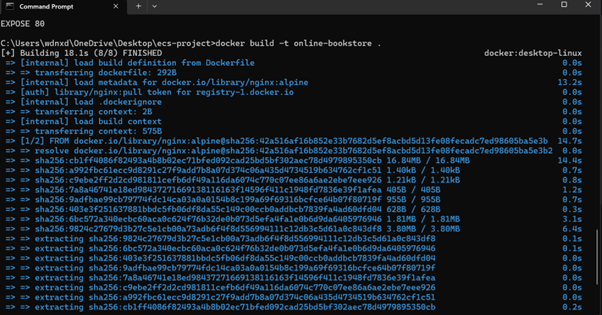
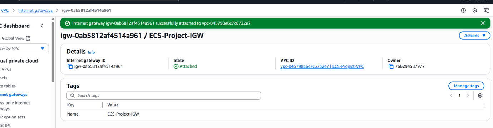
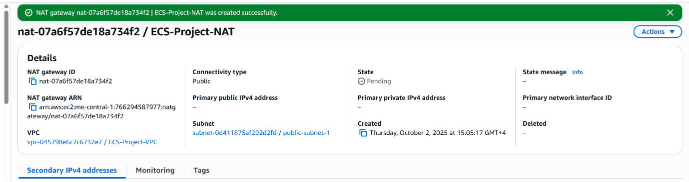
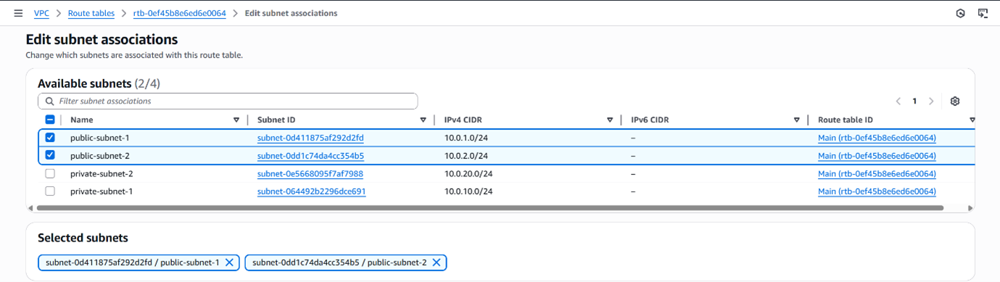
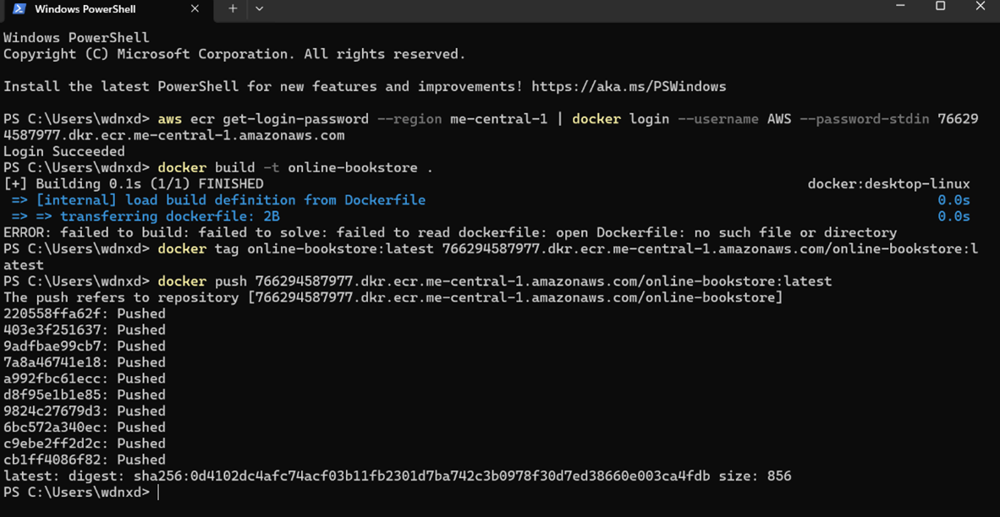
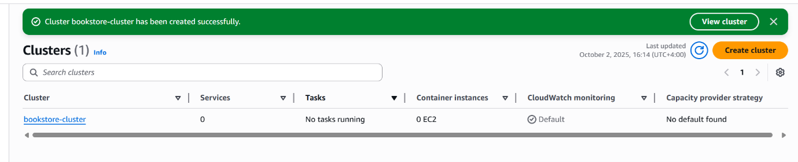
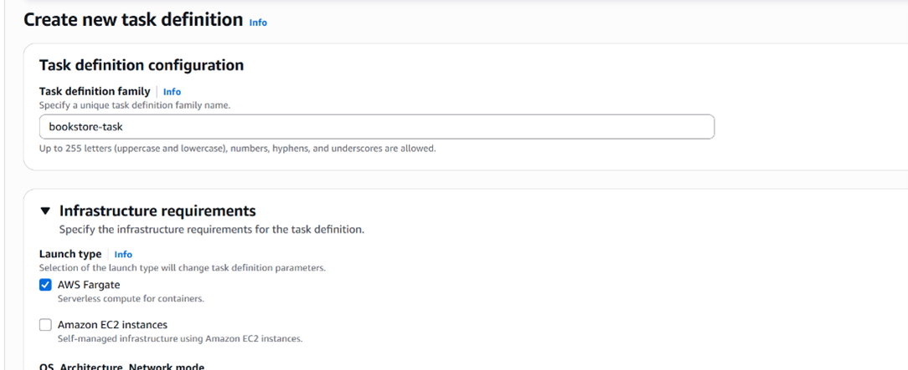
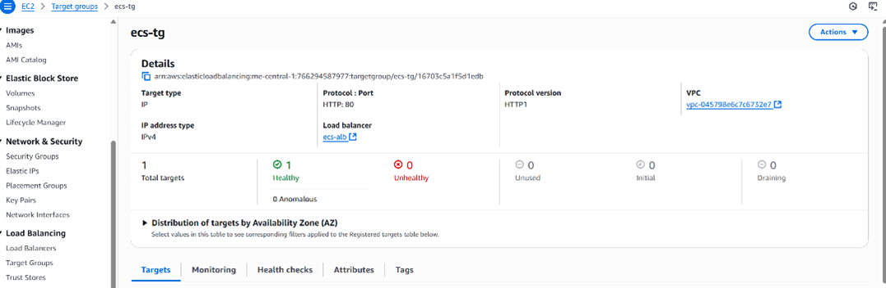

# AWS ECS Fargate Deployment: Containerized Web Application

This project demonstrates the end-to-end deployment of a containerized web application on **AWS ECS Fargate**.  
It transitions a traditional server-hosted application into a **fully managed, scalable, and highly available containerized architecture** using AWS best practices and modern DevOps principles.

---

## Project Overview

| Item | Description |
|------|-------------|
| **AWS Region** | me-central-1 |
| **Container Platform** | Docker |
| **Orchestration** | Amazon ECS Fargate |
| **Load Balancer** | Application Load Balancer |
| **Networking** | Multi-AZ VPC with Public & Private Subnets |
| **Container Registry** | Amazon ECR |
| **Security** | Security Groups, Private Subnets |
| **Monitoring** | CloudWatch Logs + ECS Task Metrics |
| **High Availability** | Multi-AZ Deployment, Auto Recovery |

---

## Architecture Overview


*This architecture deploys Nginx-based web applications in Docker containers on ECS Fargate. The application runs in private subnets, and traffic is routed through an Application Load Balancer. Public subnets host NAT Gateway for secure internet access, and the system is fully monitored via CloudWatch.*

### Key Components
- **VPC (10.0.0.0/16):** isolated network boundary for all resources  
- **Public Subnets:** host ALB and NAT Gateway  
- **Private Subnets:** run ECS tasks (containers)  
- **ECS Tasks:** containerized instances of the application  
- **Application Load Balancer:** distributes traffic evenly across containers  
- **ECR Repository:** stores container images securely  
- **Security Groups:** define inbound/outbound access rules  

---

## Phase 1 — Local Development Setup

### Objective
Prepare the local environment for containerized application development and testing.

### Steps
1. **Install Docker**
```bash
# Download Docker Desktop from https://www.docker.com/products/docker-desktop
# Verify installation
docker --version
# Expected output: Docker version 24.x.x
# Test Docker functionality
docker run hello-world
```

2. Create Project Directory
```bash
mkdir ecs-project
cd ecs-project
```
3. Create HTML Application

```bash
echo "<!DOCTYPE html>" > index.html
echo "<html><head><title>My ECS App</title></head>" >> index.html
echo "<body><h1>Hello from Amazon ECS!</h1>" >> index.html
echo "<p>This application is running in a Docker container on Fargate.</p>" >> index.html
echo "<p>Container Hostname: <span style='color:red'>HOSTNAME_PLACEHOLDER</span></p>" >> index.html
echo "</body></html>" >> index.html
```


   *HTML Application.*

4. Create Dockerfile
```bash
# Use Nginx lightweight web server
FROM nginx:alpine
```
```bash
# Copy custom HTML file
COPY index.html /usr/share/nginx/html/index.html

# Expose port 80
EXPOSE 80
```



   *Create Dockerfile*

5. Build and Test Docker Image
```bash
# Build image
docker build -t online-bookstore:latest .



   *Build Docker Image.*

# Run container locally
docker run -d -p 8080:80 --name bookstore-test online-bookstore:latest

### Verify running

### Open browser at http://localhost:8080


   *verify running locally.*

### Clean up test container
docker stop bookstore-test
docker rm bookstore-test
```

Rationale

Ensures application consistency across dev, test, and production

Validates container image before deploying to AWS

## Phase 2 — AWS VPC & Networking Setup
### Objective

Create a secure, multi-AZ network environment to host ECS Fargate tasks.

### Steps

1. Create VPC

Console → VPC → Create VPC

Name: ECS-Project-VPC

IPv4 CIDR: 10.0.0.0/16


2. Create Subnets
| Type | Name | CIDR | Purpose |
|------|------|------|---------|
| Public | public-subnet-1 / 2 | 10.0.1.0/24 / 10.0.2.0/24 | ALB & NAT Gateway |
| Private | private-subnet-1 / 2 | 10.0.10.0/24 / 10.0.20.0/24 | ECS Tasks (Containers) |


   *Subnets.*

3. Create and Attach Internet Gateway

Name: ECS-Project-IGW → Attach to ECS-Project-VPC



   *Internet Gateway.*

4. Create NAT Gateway

Public Subnet: public-subnet-1

Allocate Elastic IP



   *NAT Gateway.*

5. Create Route Tables

Public RT: 0.0.0.0/0 → IGW → associate with public subnets

Private RT: 0.0.0.0/0 → NAT → associate with private subnets


   *Edit Route Table.*



   *Edit subnet association.*

6. Create Security Groups

# ALB Security Group
Inbound: HTTP 80 → 0.0.0.0/0
Outbound: All

# ECS Task Security Group
Inbound: HTTP 80 → ALB SG
Outbound: All

Rationale

Isolates ECS tasks in private subnets

Ensures secure traffic flow through ALB

Provides internet access for containers only via NAT

## Phase 3 — ECR Repository & Container Image Push

### Objective
Create a secure container registry on AWS and push the locally built Docker image to ECR for deployment on ECS Fargate.

### Steps
1. **Create ECR Repository**
- Console → *Elastic Container Registry → Create repository*  
- Name: `ecs-bookstore-app`  
- Visibility: Private  
- Encryption: Enable using AWS managed KMS key  


   *Create Repository.*

2. **Authenticate Docker to ECR**
```bash
# Replace <AWS-REGION> with your region, e.g., me-central-1
aws ecr get-login-password --region <AWS-REGION> | docker login --username AWS --password-stdin <AWS_ACCOUNT_ID>.dkr.ecr.<AWS-REGION>.amazonaws.com
```
3. Tag Docker Image
```bash
docker tag online-bookstore:latest <AWS_ACCOUNT_ID>.dkr.ecr.<AWS-REGION>.amazonaws.com/ecs-bookstore-app:latest
```
4. Push Docker Image to ECR
```bash
docker push <AWS_ACCOUNT_ID>.dkr.ecr.<AWS-REGION>.amazonaws.com/ecs-bookstore-app:latest
```


   *Push Command instruction.*



   *Pushing commands to ECR.*


5. Verify Image in ECR

Console → Elastic Container Registry → Repositories → ecs-bookstore-app

Confirm latest tag is available

Rationale

Storing the image in ECR allows ECS Fargate to securely pull it for deployment.

Versioning and tagging images ensure reproducible deployments.

ECR integrates with IAM for access control and encryption at rest.

## Phase 4 — ECS Cluster & Task Definition

### Objective
Deploy a managed container orchestration environment with AWS ECS Fargate and define the container runtime parameters.

### Steps
1. **Create ECS Cluster**
- Console → *Elastic Container Service → Clusters → Create Cluster*  
- Cluster type: *Networking only (AWS Fargate)*  
- Cluster name: `bookstore-cluster`  
- Click **Create Cluster** and wait for status to be `ACTIVE`.



   *Create ECS Cluster.*


2. **Create Task Definition**
- Console → *ECS → Task Definitions → Create new Task Definition*  
- Launch type: FARGATE  
- Task Definition Name: `bookstore-task`  
- Task Role: None (optional, assign later if needed)  
- Network Mode: `awsvpc`  
- Task execution role: *Create new role*  
- Task CPU: 0.25 vCPU  
- Task Memory: 0.5 GB  



   *Task Definition.*

3. **Add Container**
- Container Name: `bookstore-container`  
- Image: `<AWS_ACCOUNT_ID>.dkr.ecr.<AWS-REGION>.amazonaws.com/ecs-bookstore-app:latest`  
- Port Mappings: Container port 80 → TCP  
- Essential: Yes  

```bash
# Optional command if using custom commands
# CMD ["nginx", "-g", "daemon off;"]
4. Click Add → Create Task Definition
```

Rationale

ECS cluster provides a fully managed environment for running containers without provisioning servers.

Fargate launch type eliminates server management, ensuring serverless container orchestration.

Task definitions define CPU, memory, networking, and container images for reproducibility.

Using awsvpc mode gives each task its own ENI for better security and isolation.

## Phase 5 — ECS Service & Load Balancer Configuration

### Objective
Deploy the containerized application on ECS Fargate and configure high availability with an Application Load Balancer (ALB).

### Steps
1. **Create ECS Service**
- Console → *ECS → Clusters → bookstore-cluster → Services → Create*  
- Launch type: FARGATE  
- Task Definition: `bookstore-task:1` (latest revision)  
- Service Name: `bookstore-service`  
- Number of tasks: 1 (adjust later for scaling)  

2. **Configure Networking**
- Cluster VPC: `ECS-Project-VPC`  
- Subnets: `private-subnet-1` & `private-subnet-2`  
- Security Groups: `ecs-task-sg`  
- Auto-assign Public IP: **DISABLED**  

3. **Configure Load Balancer**
- Load Balancer Type: *Application Load Balancer (ALB)*  
- ALB Name: `ecs-alb`  
- Listener: HTTP 80  
- Target Group Name: `ecs-tg`  
- Target Type: IP  
- Health Check Path: `/`  


   *Configure Containers.*


   *Cluster Overview.*


4. **Complete Service Creation**
- Review all settings  
- Click **Create Service**  
- Wait for the service to stabilize; tasks should show as `RUNNING`  

### Rationale
- ECS Service ensures tasks are continuously running and automatically restarted if they fail.  
- Using an ALB allows traffic distribution across multiple tasks, supporting high availability.  
- Private subnets for tasks maintain network security while ALB handles public access.  
- Health checks monitor application health and remove unhealthy tasks automatically.

## Phase 6 — Testing and Validation

### Objective
Verify end-to-end functionality, load balancer routing, and high availability of ECS tasks.

### Steps
1. **Application Access Test**
- Retrieve ALB DNS:  
  EC2 Console → Load Balancers → `ecs-alb` → Copy DNS Name  
- Open web browser and navigate to:  
  `http://ecs-alb-xxxxxxxxx.me-central-1.elb.amazonaws.com`  
- Expected Result: "Hello from Amazon ECS!" page is displayed  


   *Hello from Amazon ECS!" page is displayed*

2. **Verify Load Balancer Health**
- Target Groups → `ecs-tg` → Targets Tab  
- Status should be: `healthy`  
- Health checks path `/` confirms tasks are reachable  



   **Verify Load Balancer Health*

3. **High Availability Test**
- Monitor running tasks:  
  ECS → Clusters → `bookstore-cluster` → Tasks Tab  
- Stop a running task manually:  
  Select task → Stop → Confirm  
- ECS Service automatically provisions a new task  
- Target group health remains `healthy`  

### Rationale
- Ensures that the application is accessible via ALB.  
- Validates ECS Service self-healing and automatic task replacement.  
- Confirms that load balancer distributes traffic to healthy containers only.  
- Demonstrates the resilience and high availability of the containerized architecture.
## Results and Observations

| Control Area           | Verification                                   | Outcome |
|------------------------|-----------------------------------------------|---------|
| Network Isolation      | ECS tasks running in private subnets, no public IP | TRUE    |
| Load Balancer Routing  | ALB distributes traffic to healthy tasks      | TRUE    |
| Auto-Recovery          | Stopped ECS tasks automatically replaced     | TRUE    |
| Container Functionality| Web application responds correctly           | TRUE    |
| High Availability      | Target group remains healthy during failover | TRUE    |

*The ECS Fargate deployment achieved full compliance with cloud-native best practices:*

- **Resilient architecture:** ECS service self-healing and task auto-replacement  
- **Scalable design:** Load balancer handles traffic spikes automatically  
- **Secure networking:** Private subnets and security groups isolate tasks  
- **Operational visibility:** Monitoring through AWS CloudWatch  

---

## Conclusion

This project demonstrates the deployment of a containerized web application on **AWS ECS Fargate** with high availability, secure networking, and automatic scaling.  

Key takeaways:

- **Consistency:** Containers ensure the same environment across dev, test, and production  
- **Automation:** ECS service manages scaling and self-healing without manual intervention  
- **Security:** VPC, private subnets, and security groups protect internal resources  
- **Resilience:** Application Load Balancer distributes traffic and maintains uptime during failures  

By following this architecture, developers and businesses can deploy modern cloud-native applications efficiently while ensuring operational stability and security.


